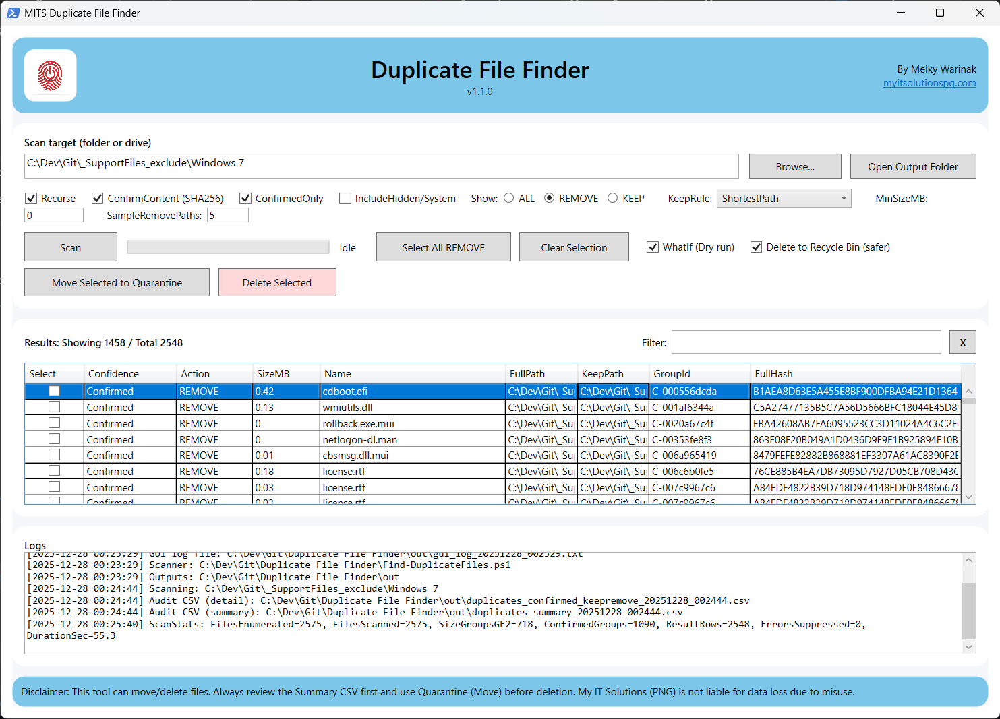

# MITS Duplicate File Finder

**Author:** Melky Warinak  
**Organisation:** My IT Solutions (PNG)

**Website:** myitsolutionspg.com  

A PowerShell + graphical tool for safely detecting, reviewing, and removing duplicate files using size grouping and SHA-256 content hashing. Designed for large folders, archives, OS images, and file servers.

---

## 1. Purpose

This tool helps you:

- Detect duplicate files reliably
- Decide which copies to KEEP and which to REMOVE
- Review results visually before deleting
- Export full audit CSVs for compliance and rollback
- Safely delete files (Recycle Bin supported)
- Quarantine files instead of deleting them

It is intended for administrators, IT support, and power users.

---

## 2. Components

The solution consists of two scripts:

| File | Purpose |
|---|---|
| `MITS-DuplicateFileFinder-GUI.ps1` | WPF GUI front-end | 
| `Find-DuplicateFiles.ps1` | Backend scanning & hashing engine |

The GUI calls the scanner script during execution.

---

## 3. Requirements

- Windows PowerShell 5.1+
- .NET Framework (default on Windows)
- NTFS file system recommended
- Sufficient permissions to read/delete target files

---

## 4. Launching the Tool

```powershell
powershell -ExecutionPolicy Bypass -File .\MITS-DuplicateFileFinder-GUI.ps1
```

⚠️ For best results, run PowerShell as Administrator when scanning system folders.

---

## 5. GUI Overview

The interface is divided into four main sections:

1. Scan Configuration  
2. Scan & Action Controls  
3. Results Grid  
4. Logs & Audit Trail  

---

## 6. Scan Configuration (Top Section)

### 6.1 Scan Target (Folder or Drive)

**Textbox:**  
Path to the folder or drive you want to scan.

**Buttons:**
- **Browse…** – Select a folder using a dialog
- **Open Output Folder** – Opens the output directory containing logs and CSVs

### 6.2 Options & Switches

✅ **Recurse**
- When enabled, scans all subfolders
- When disabled, scans only the selected folder  
Recommended: Enabled

✅ **ConfirmContent (SHA256)**
- Performs SHA-256 hashing
- Confirms files are bit-for-bit identical
- Prevents false positives (same name/size but different content)  
Impact: Slower scan, higher accuracy  
Recommended: Enabled

✅ **ConfirmedOnly**
- Shows only duplicates that passed hash confirmation
- Hides unconfirmed size-based matches  
Recommended: Enabled for safety

⬜ **IncludeHidden/System**
- Includes hidden and system files (e.g. OS files)
- Disabled by default to reduce risk  
⚠️ Use with caution

### 6.3 Show Filter (Radio Buttons)

Controls what appears in the Results grid:

- **ALL** – Show all duplicate candidates
- **REMOVE** – Show only files marked for removal
- **KEEP** – Show only files marked to keep

Useful for review before actions.

### 6.4 Keep Rule

Dropdown determining which duplicate copy is kept automatically. The selected rule determines the **KEEP / REMOVE** classification inside each duplicate group.

| Rule | What it keeps | Notes |
|---|---|---|
| **ShortestPath** | The file with the shortest full directory path | Good default; tends to keep the “closest”/cleanest path |
| **LongestPath** | The file with the longest full directory path | Useful when you want to keep the most deeply nested copy |
| **NewestWriteTime** | The file with the most recent **LastWriteTime** | Keeps the most recently modified file |
| **OldestWriteTime** | The file with the oldest **LastWriteTime** | Keeps the earliest/legacy copy |
| **NewestCreationTime** | The file with the most recent **CreationTime** | Keeps the newest created file |
| **OldestCreationTime** | The file with the oldest **CreationTime** | Keeps the oldest created file |

### 6.5 MinSizeMB

- Minimum file size (in MB) to include
- Files smaller than this value are ignored  
Default: `0` (include all)

### 6.6 SampleRemovePaths

- Limits how many REMOVE paths are sampled per duplicate group
- Used for reporting and safety previews

---

## 7. Scan & Action Controls (Middle Section)

### 7.1 Scan Button
Starts the duplicate scan using current settings.  
The progress bar updates while scanning.

### 7.2 Select All REMOVE
Automatically selects all rows marked as REMOVE in the results grid.  
Used before delete or quarantine.

### 7.3 Clear Selection
Clears all selected checkboxes.

### 7.4 WhatIf (Dry run)
Simulates delete actions:
- Logs what would be deleted
- No files are actually removed  
Recommended for first runs.

### 7.5 Delete to Recycle Bin (safer)
- Sends files to the Recycle Bin (allows recovery)
- If unchecked, files are permanently deleted.

### 7.6 Move Selected to Quarantine
Moves selected files to a quarantine folder instead of deleting.  
Useful for cautious cleanup or audits.

### 7.7 Delete Selected
Deletes selected files based on:
- WhatIf setting
- Recycle Bin setting

⚠️ Always review the Results grid before clicking.

---

## 8. Results Grid (Core Review Area)

This is the most important part of the tool.

### 8.1 Grid Behaviour
- Auto-resizes vertically with the window
- Vertical scrollbar always visible when needed
- No horizontal scrollbar (by design)
- Long values are handled safely (see below)

### 8.2 Columns Explained

| Column | Description |
|---|---|
| **Select** | Checkbox for actions |
| **Confidence** | Confirmed / Unconfirmed |
| **Action** | KEEP or REMOVE |
| **SizeMB** | File size |
| **Name** | File name |
| **FullPath** | Full file path |
| **KeepPath** | Path of the kept copy |
| **GroupId** | Duplicate group identifier |
| **FullHash** | SHA-256 hash |

---

## 9. Filter Box

**Text Filter**
- Filters results in real time
- Matches against visible columns
- Useful for searching filenames, paths, or hashes

**Clear (X) Button**
- Clears the filter instantly

---

## 10. Logs Panel (Bottom Section)

Displays real-time execution logs including:

- Scan start/end
- Files enumerated
- CSV export paths
- WhatIf actions
- Deletions and quarantine moves

This acts as a live audit trail.

---

## 11. Output Files

All outputs are written to the `out` directory:

| File | Purpose |
|---|---|
| `duplicates_confirmed_keepremove_*.csv` | Full detailed audit |
| `duplicates_summary_*.csv` | Summary report |
| `gui_log_*.txt` | GUI execution log |

⚠️ Always review the Summary CSV before deleting in production environments.

---

## 12. Recommended Safe Workflow

1. Enable:
   - ConfirmContent (SHA256)
   - ConfirmedOnly
   - WhatIf (Dry run)
2. Run Scan
3. Review Results Grid
4. Review Summary CSV
5. Disable WhatIf
6. Use Move to Quarantine first
7. Finally, use Delete Selected

---

## 13. Known Design Decisions

- Emphasis on readability and safety
- CSV files act as the authoritative record
- GUI focuses on decision-making, not raw data dumping

---

## 14. Disclaimer

This tool can move or delete files. Always review CSV outputs and test with WhatIf mode first.  
My IT Solutions (PNG) and the author are not liable for data loss due to misuse.
